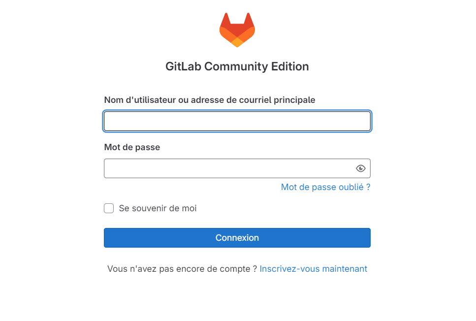
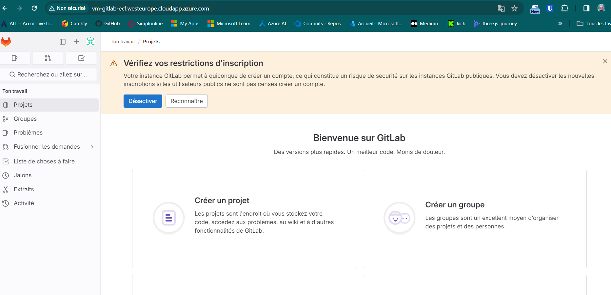
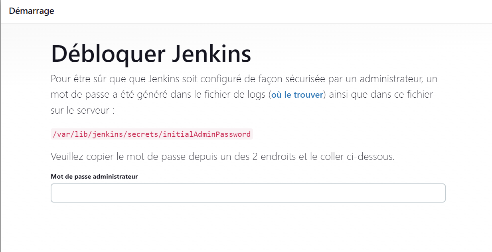
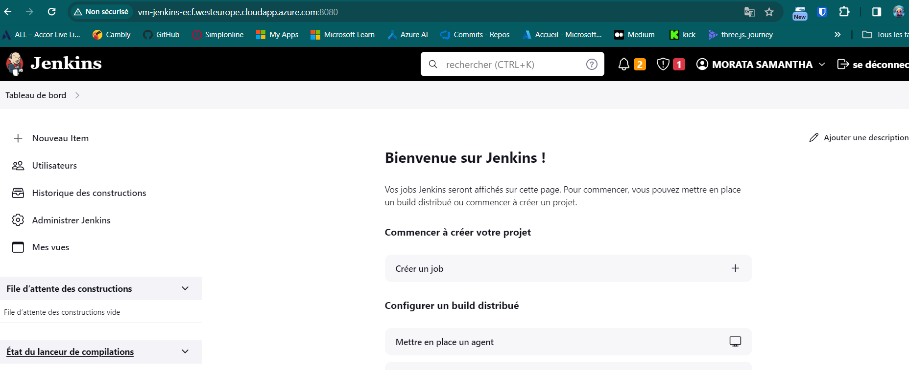

# Configuration d'une machine virtuelle personnalisée pour Gitlab et Jenkins

  
Ce document détaille les étapes nécessaires pour créer une machine virtuelle personnalisée dédiée aux serveurs Gitlab et Jenkins, ainsi que les processus d'installation et de configuration associés.

  

## Gitlab

  
### Création d'un principal de service Azure AD

  
Pour créer un principal de service, exécutez la commande suivante en remplaçant les valeurs nécessaires :

1.  **Utilisation de la commande Azure CLI :** Utilisez la commande suivante pour créer un principal de service, en remplaçant `<subscription_id>` par l'ID de votre abonnement Azure et `<resource_group_name>` par le nom de votre groupe de ressources :

```bash

`az ad sp create-for-rbac --role Contributor --scopes /subscriptions/<subscription_id>/resourceGroups/<resource_group_name> --query "{ client_id: appId, client_secret: password, tenant_id: tenant }"` 
```

La création d'un principal de service Azure AD est nécessaire pour autoriser l'accès sécurisé aux ressources Azure. Voici quelques raisons pour lesquelles cette étape est importante :

-   **Authentification sécurisée :** Le principal de service fournit un identifiant unique (`client_id`) et un secret (`client_secret`) qui sont utilisés pour authentifier et autoriser l'application ou le script à accéder aux ressources Azure.
    
-   **Contrôle d'accès :** En attribuant des rôles appropriés au principal de service, vous pouvez contrôler précisément les autorisations accordées à l'application ou au script. Par exemple, en lui attribuant le rôle de contributeur, vous lui accordez des autorisations pour créer, modifier et supprimer des ressources dans le groupe de ressources spécifié.
    
-   **Traçabilité :** En utilisant des principaux de service distincts pour différentes applications ou scripts, vous pouvez suivre et auditer précisément l'accès aux ressources Azure. Cela permet une meilleure gestion des risques et une conformité accrue aux politiques de sécurité.

2. Après avoir créé un principal de service Azure AD à l'aide de la commande `az ad sp create-for-rbac`, il est essentiel de stocker les informations générées de manière sécurisée. Les variables doivent être stockées dans un fichier de configuration au format HCL (HashiCorp Configuration Language), tel que `secret.auto.pkvars.hcl`, avec les valeurs formatées comme suit :

```hcl
client_id       = "your_cliendt_id"
client_secret   = "your_client_secret"
tenant_id       = "your_tenant_id"
subscription_id = "your_subscription_id"
```

3.  **Personnalisation des données communes :** Dans le fichier common.auto.pkvars.hcl, modifiez les données communes telles que `project_prefix`, `project_name`, `tenant_id` et `subscription_id` en fonction de votre environnement spécifique.
    
4.  **Création de l'image personnalisée avec Packer :** Une fois que les variables sont configurées, lancez la construction de l'image personnalisée avec Packer en utilisant la commande `packer build .`. Cette commande exécutera les scripts de provisionnement spécifiés et créera une image conforme à vos spécifications.


## Infrastructure avec Terraform

Modifiez les variables du fichier `variables.tf`, ainsi que `source_address_prefix`  `admin-user` dans `terraform.tf`.

Ensuite, exécutez les commandes suivantes :

```bash
terraform init
terraform plan
terraform apply 
``` 

Une fois l'infrastructure déployée, connectez-vous en SSH à la machine via :

```bash
ssh <you_admin_username<@<ip_public>
```

Lors de l'application, une clé SSH est créée dans le dossier `ssh_key`.

Vérifiez l'installation de Gitlab sur la machine avec :

```bash
sudo gitlab-ctl status
```

Si tous les services indiquent "ok-run", l'installation s'est bien déroulée et Gitlab est correctement configuré.

Accédez à l'interface de Gitlab via votre FQDN. 



Pour vous connecter, utilisez l'utilisateur "root". Pour récupérer le mot de passe, accédez à `/etc/gitlab/initial-root-password`.



Si rien ne se passe lors de l'exécution de `sudo gitlab-ctl status`, reconfigurez l'installation en accédant à `/etc/gitlab/gitlab.rb`, modifiez l'URL externe avec votre FQDN et relancez l'installation avec :

```bash
sudo gitlab-ctl reconfigure
```

Redémarrez ensuite Gitlab avec :

```bash
sudo gitlab-ctl restart
```

## Jenkins

Il n'est pas nécessaire de recréer un principal de service. Il suffit de modifier les variables de Packer et de Terraform comme pour Gitlab. Une fois connecté en SSH à la machine, vérifiez le statut avec :

```bash
sudo systemctl status jenkins`
```

Le statut doit être "running".

Accédez à l'interface de Jenkins sur le port 8080.



 Lors de la première connexion, récupérez le mot de passe dans `/var/jenkins/secrets/initialAdmin/Password`. Connectez-vous en tant que root pour y accéder (`sudo su`), puis copiez le mot de passe dans Jenkins et créez un utilisateur.





